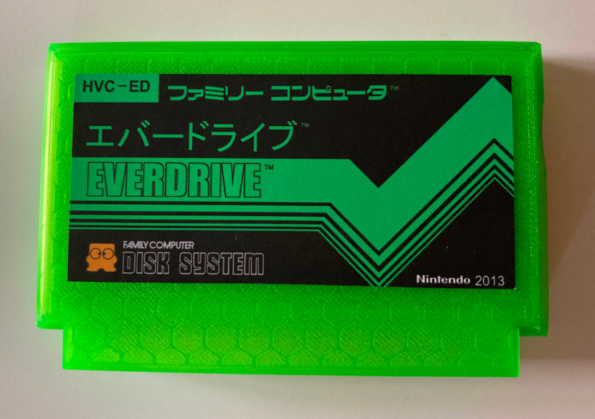
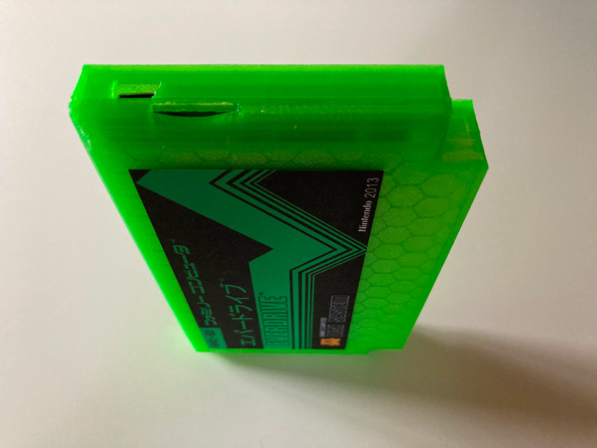

# Shell for Famicom Everdrive N8, with USB port

This is a snap-shell for the Famicom Everdrive N8 with a hole for the optional, user-installed, USB port.

There's some information about installing the USB port [on the Krikzz forum](https://krikzz.com/forum/index.php?topic=2003.0).  The tools to use the USB port are available [on Krikzz's FTP site](https://krikzz.com/pub/support/everdrive-n8/original-series/development/).

The [label used in this photo](labels/Famicom Everdrive Green.png) is a modified version of the labels available [on this forum thread](https://krikzz.com/forum/index.php?topic=333.0) ([cached here](labels/)). They should be printed at about 9cm x 4.3cm in size.

## License

Original model by [Blackchamber](https://www.thingiverse.com/Blackchamber) from [Thingiverse](https://www.thingiverse.com/thing:117607/), [relicensed](images/relicense.png)[¹](https://www.thingiverse.com/thing:117607/comments#comment-6479409) under CC-BY.

Uses snippets from NopSCADlib for the USB and micro-SD portions, licensed under the GNU GPL v3 or later.
